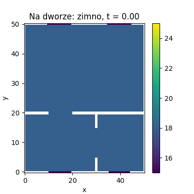

## Opis projektu
Celem projektu była optymalizacja ogrzewania w pomieszczeniach. Do tego celu posłużyło nam równanie różniczkowe cząstkowe - równanie ciepła, które zamieniono na odpowiadający mu schemat numeryczny.

Rozważone zostały następujące problemy:

Czy grzejnik powinien być pod oknem? W tym celu porównano jak rozkłada się ciepło w zależności od umiejscowienia grzejnika. Zrobiono to na trzech poziomach temperatur i przedstawiono w postaci animacji (umieszczone niżej jako "Wizualizacje"). 

Czy warto wyłączać grzejniki gdy wychodzimy z domu? Porównano ile ciepła zostanie dostarczone w zależności, czy zostawiamy grzejnik włączony czy wyłączamy go w godzinach 10:00-16:00. 

Dane użyte do określenia temperatury w oknach to temperatury.txt, zostały wygenerowane przy pomocy ChatGPT. Są to temperatury na trzech poziomach: chłodno (10-15 stopni Celsjusza), zimno (2 do 7 stopni Celsjusza), oraz bardzo zimno (-5 do 0 stopni Celsjusza), oraz podziałka godzinowa gdzie doba została podzielona na fragmenty o długości 3 minuty.

W pliku pipeline.ipynb znajduje się notatnik, w którym zostały przeprowadzone obliczenia. Tworzymy klasę Room opisującą pokój, nadajemy jej parametry związane z jego rozmiarem, umiejscowieniem drzwi, okien i grzejników a także tworzymy tam macierz temperetur w zależności od czasu. Klasa ta posiada funkcję laplasjan(), tworzącą nam odpowiednią macierz Laplace'a do obliczeń a także funkcję update(), która aktualizuje nam macierz temperatury w kolejnym kroku czasowym. Drugą klasą jest Apartment, czyli klasa opisująca nam całe mieszkania. Zawiera ona pokoje, czyli elementy klasy Room. Jest tam funkcja merge(), która pozwala nam na łączenie poszczególnych macierzy ciepła dla pokoi w macierz dla całego mieszkania. Rezultaty obliczeń wyświetlamy jako animowaną mapę ciepła. 

Plik requirements.txt umożliwia automatyczne zaistalowanie paczek potrzebnych do odtworzenia obliczeń po wpisaniu w terminal pip install -r requirements.txt.

## Wizualizacje
Rozważając temperaturę na poziomie "chłodno" otrzymujemy następujące mapy ewolucji ciepła w zależności od ustawienia grzejników pod oknami lub na przeciwległych ścianach:

Biorąc pod uwagę poziom temperatury "zimno", wygląda to następująco:

Natomiast na poziomie "bardzo zimno":

